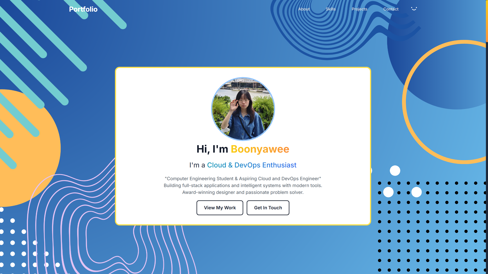
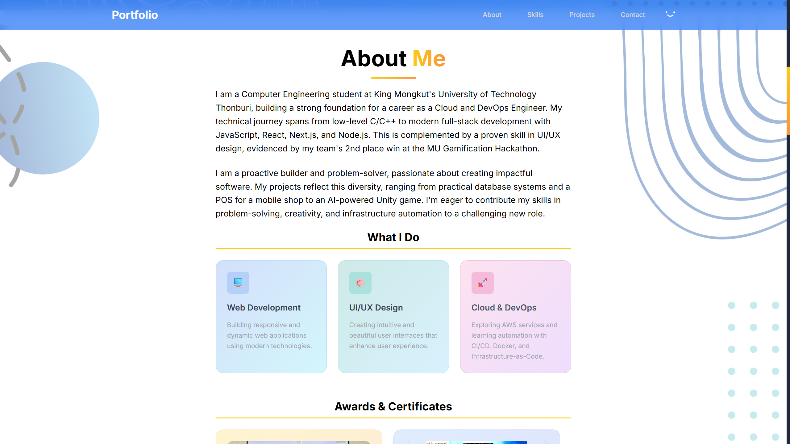
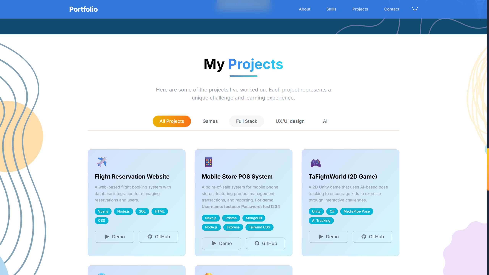
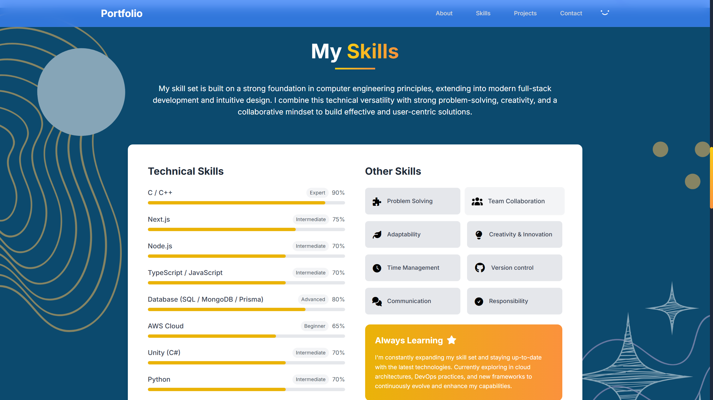
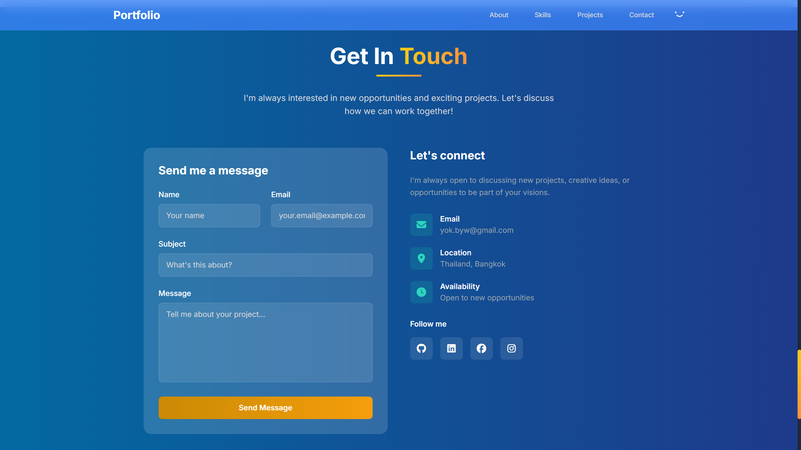

### Portfolio — Cloud & DevOps Enthusiast (Next.js + Tailwind)

Modern, responsive personal portfolio built with Next.js and Tailwind CSS. Designed to showcase projects, skills, and personality with smooth interactions and clean visual design.

— Built by Boonyawee: Computer Engineering student and aspiring Cloud/DevOps engineer.

## Demo

- Live site: https://d3cjdq9tq2wsde.cloudfront.net/

## Screenshots







## Key Features

- **Polished hero section** with rotating role tagline and subtle animations
- **Responsive** from mobile to desktop, optimized typography and spacing
- **Email-ready contact** section (EmailJS setup included)
- **Static export** compatible for CDN hosting (S3/CloudFront, GitHub Pages, etc.)

## Tech Stack


### AWS Services Used

- Amazon S3 (static asset hosting)
- Amazon CloudFront (global CDN + OAC to S3 origin)
- AWS IAM (least-privilege deploy role, scoped to S3 + CloudFront invalidation)

## AWS Architecture (Static Hosting)

- Build: `next build && next export` → generates static assets in `out/`
- Storage: **Amazon S3** bucket for hosting static site (private bucket is recommended)
- CDN: **Amazon CloudFront** in front of S3 with Origin Access Control (OAC)

## Quickstart

```bash
# Install
npm install

# Run dev server
npm run dev

# Production build
npm run build
npm start  # or: npm run preview if using a static host after export

# Optional: export static site
npm run build && npx next export
# Output will be in the out/ directory
```

Open `http://localhost:3000` to view.

## Project Structure

```
src/
  app/
    layout.tsx        # Root layout, global metadata
    page.tsx          # Homepage composition
    globals.css       # Tailwind base styles
  components/
    Hero.tsx          # Rotating text, smooth scroll actions
    About.tsx         # Bio and value proposition
    Projects.tsx      # Projects showcase
    Skills.tsx        # Tech stack and proficiencies
    Contact.tsx       # Contact form / links 
    Navbar.tsx        # Top navigation
    Footer.tsx        # Footer and social links
public/               # Images and static assets
```

## Deployment

- **Static hosting (S3/CloudFront, GitHub Pages)**: `next build && next export`, upload `out/`

## CI/CD Pipeline (GitHub Actions → S3/CloudFront)

Automated build and deploy on push to `main`.

### What it does

1. Check out code and set up Node.js
2. Install dependencies and build Next.js
3. Export static site to `out/`
4. Sync `out/` to S3 (delete removed files)
5. Invalidate CloudFront cache for immediate updates

## Contact

- LinkedIn: https://www.linkedin.com/in/boonyawee-wasupornrujee-464998369/
- Email: yok.byw@gmail.com
